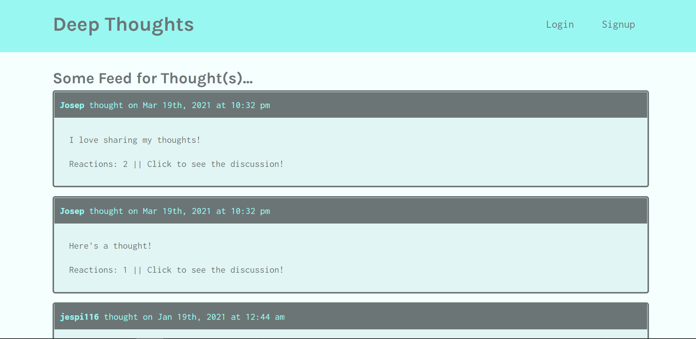
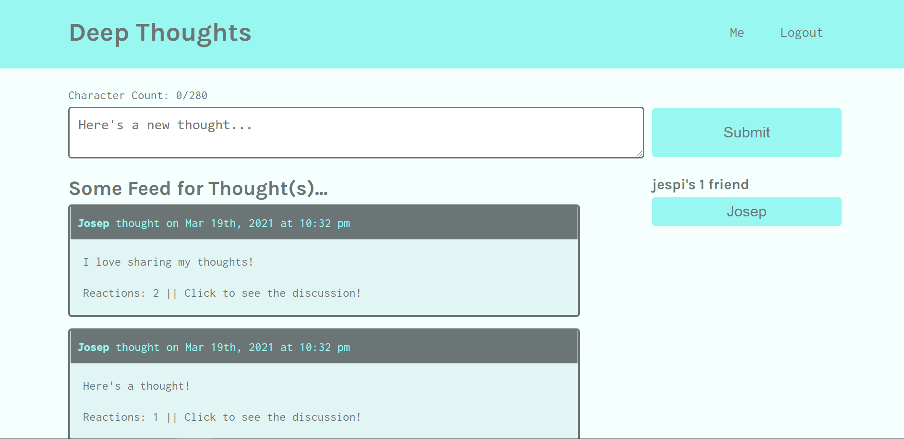

# Deep Thoughts


## Description
A simple social network for sharing and discussing thoughts. Share thoughts, react to other's thoughts, and add friends!

## Technologies
* HTML
* CSS
* Javascript
* React.js
* Apollo
* Express.js
* NoSQL
* Mongoose/MongoDB
* GraphQL


## Usage

Run the following command to install necessary dependencies
```
npm i
```
Run the following to install concurrently, a necessary development dependency which runs two servers at the same time. these servers are required for running bot the front end and backend at the same time.
```
npm i -D concurrently
```
Run the following command to start your local servers
```
npm start
```
Your browser should automatically open at 'localhost:3000' where the webpage should be. Alternatively the link to the live page hosted on heroku should be below!


## Link

https://nameless-crag-10294.herokuapp.com/

## Iamge Previews
### Home Page
 
<br/><br/>

### Home page (Logged In)


## License

This project is licensed under the MIT license.

## Questions:

If you have any questions about the repo, open an issue or contact me directly at Jespi116@fiu.edu. you can find more of my work at [Jespi116](https://github.com/Jespi116)
